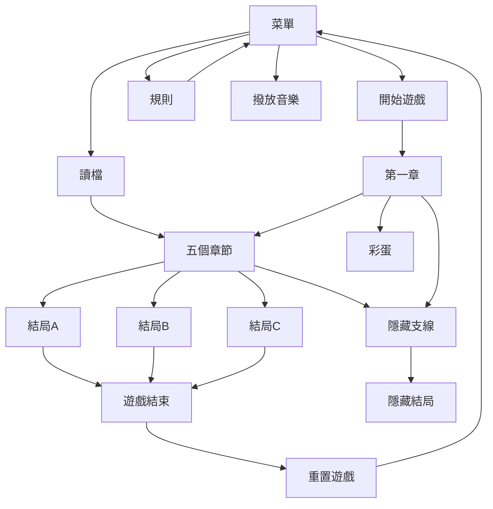

# web final project
## 00957026鄭立揚
## 00957049林家安

---

# Menu
- 作品名稱-快樂的一天
- 網頁結構
- 基本技術
--CSS
--JavaScript
- 其他技術
--JQuery
- 參考範例 

---

## 網頁結構

----

# 遊玩展示圖

----

## 主畫面

----

## 規則

----

## 進入遊戲

---

## 基本技術
### CSS

用CSS來設計網頁的外觀

---

## 基本技術
### JavaScript

運用JavaScript來操作互動的功能和故事的運作
Load_Game    是來實現存檔功能
Initial_Game 用來重製遊戲內部的數據

---

## 其他技術
### JQuery

利用jquery來執行換頁時
更改背景以及播放音效
play 為更換音效
DE_3 為更換背景顏色

---

## 分工

|  分工  | 林家安 | 鄭立揚 |
| ----- | ----- | ----- |
|  美術  |  20%  |  80%  |
|  故事設計  |  50%  |  50%  |
|  簡報  |  50%  |  50%  |
|  首頁  |  30%  |  70%  |
|  分頁  |  70%  |  30%  |
|  彩蛋  |  50%  |  50%  |
| github |  0%  |  100%  |

---

## 參考範例
### W3school
https://www.w3schools.com/

---